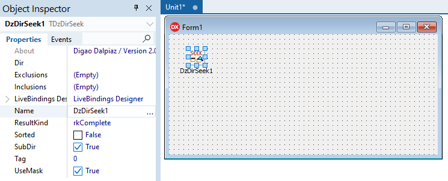

# DzDirSeek

## Delphi non-visual component to search files in directories




- [What's New](#whats-new)
- [Introduction](#introduction)
- [Installing](#installing)
- [How to use](#how-to-use)
- [TDSFile object](#tdsfile-object)
- [Properties](#properties)
- [Global Functions](#global-functions)

## What's New

- 12/17/2020 (Version 2.1)

   - New `IncludeHiddenFiles` and `IncludeSystemFiles` properties.
   - New `ResultList` using new custom TDSFile object. If you want to get result in Strings list, you can use new method `GetResultStrings`.

- 11/22/2020 (Version 2.0)

   - New `Inclusions` and `Exclusions` properties.
   - Included Demo application.

- 10/31/2020 (Version 1.3)

   - Included Delphi 10.4 auto-install support.

- 10/27/2020 (Version 1.2)

   - Fixed previous Delphi versions (at least on XE2, XE3, XE4 and XE5) package tag. It was causing package compilation error.

- 10/26/2020 (Version 1.1)

   - Updated CompInstall to version 2.0 (now supports GitHub auto-update)

- 05/03/2020

   - Updated CompInstall to version 1.2

## Introduction

When using Delphi and working with files and directories, eventually you need to search and get a list of files in a directory, or even search files in sub-directories.

This could be a little difficult using old `FindFirst` and `FindNext` functions. Now we have new methods overloads `TDirectory.GetFiles`, available at `System.IOUtils` unit.

But, even using GetFiles methods, if you need some advanced parameters like include sub-directories, you will need to iterate all directories. Also if you want to specify mask that include some part of path string, you will need to work with strings in your code every time you need this resource.

So, I decided to build this component to become an easy way to search files.

## Installing

### Auto install

Close Delphi IDE and run **CompInstall.exe** app to auto install component into Delphi.

### Manual install

1. Open **DzDirSeek** package in Delphi.
2. Ensure **Win32** Platform and **Release** config are selected.
3. Then **Build** and **Install**.
4. If you want to use Win64 platform, select this platform and Build again.
5. Add sub-path Win32\Release to the Library paths at Tools\Options using 32-bit option, and if you have compiled to 64 bit platform, add sub-path Win64\Release using 64-bit option.

Supports Delphi XE2..Delphi 10.4

## How to use

Just fill desired properties and call method `Seek`.

Then you can read the public property `ResultList` to get all found files. This list contains `TDSFile` objects.

## TDSFile object

When you run a directory seek, the result will be retrieved in `ResultList` property, which contains `TDSFile` objects. You can iterate this list to obtain results properties.

### TDSFile properties

`BaseDir` = directory path used when search started.

`RelativeDir` = directory path without Base Directory prefix.

`Name` = only file name part.

`Size` = File size in bytes.

`Attributes` = File attributes (The same as TSearchRec.Attr property).

`Timestamp` = File last write Date and Time.

## Result as String List

If you want to get only the file path strings list, you can use the method `GetResultStrings`:

```delphi
procedure GetResultStrings(S: TStrings; Kind: TDSResultKind);
```

Where `Kind` property represents:
- rkComplete: The result will include the full file path (search path + sub-directories + file name)
- rkRelative: The result will include only the relative path, without the search path (sub-directories + file name)
- rkOnlyName: The result will include only the file name, without search path or sub-directories.

## Properties

`Dir: String` = Path to search

`Inclusions: TStrings` = If any line is specified, the component will search only the masks specified here, according to the mask syntax described below.

`Exclusions: TStrings` = Right after `Inclusions` check, if file matches `Exclusions` masks (according to the mask syntax described below), then it will be excluded from search. 

**Masks syntax:**

```
*.txt
myapp.exe
*xyz*.doc
myfile?.rtf
*\sub_path\*
first_path\*
path1\path2\file.avi
<F>*abc*
```

> If you use the string `<F>` with a mask, it will be considered only the file name part of the path. This is useful when the mask could be confused with the directory part.

Example: Let's assume there is a path C:\MyApp. Inside this folder there is another folder C:\MyApp\SubFolder. Inside this last folder, there is a file called my_app_file.txt.

So, if we need to exclude all files that contains the text "app", we can specify at Masks property: `*app*`. But in this case, the folder will be excluded too, because they matches the expression `*app*`, and assuming that we want to include this directory because there are another files with other different names. In this case, we can use `<F>*app*`. This will consider only the file name part when the component checks the masks.

*These properties depends on **UseMask** property enabled.*

`Sorted: Boolean` = If enabled, it will retrieve directories and files alphabetically sorted. (default False)

`SubDir: Boolean` = If enabled, it will scan files in all sub-directories inside search path. (default True)

`UseMask: Boolean` = If enabled, it will consider `Inclusions` and `Exclusions` properties. If disabled, it will retrieve always all files. (default Enabled).

`IncludeHiddenFiles` = If enabled, it will include hidden files and folders (only works on Windows platform).

`IncludeSystemFiles` = If enabled, it will include system files and folders (only works on Windows platform).

## Global Functions

```delphi
//Returns bytes in megabytes string format, with two decimal places.
function BytesToMB(X: Int64): string;

//Returns file size in bytes.
function GetFileSize(const aFileName: string): Int64;

//Returns if an attribute enumerator contains a specific attribute (use System.SysUtils consts: faReadOnly, faHidden, faDirectory...)
function ContainsAttribute(AttributesEnum, Attribute: Integer): Boolean;
```
